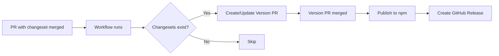
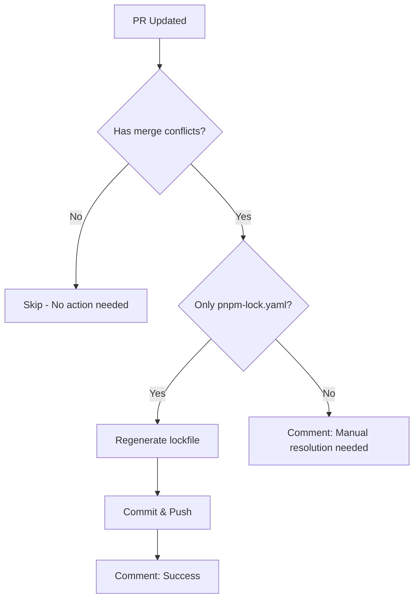

# GitHub Workflows Documentation

This document describes the automated workflows configured for the Object UI repository.

## Overview

Our GitHub Actions workflows automate testing, security scanning, dependency management, and deployment processes. All workflows are located in `.github/workflows/`.

## Workflows

### 1. CI (Continuous Integration)

**File**: `ci.yml`  
**Triggers**: Push to `main`/`develop`, Pull Requests

This is the main CI pipeline that ensures code quality.

**Jobs**:
- **Test**: Runs tests on Node.js 18.x and 20.x
  - Executes unit and integration tests
  - Generates coverage reports (Node 20.x only)
  - Uploads coverage to Codecov
  
- **Lint**: Checks code style and quality
  - Runs ESLint on all packages
  - Ensures code follows project standards
  
- **Build**: Validates that all packages build successfully
  - Builds all packages in the monorepo
  - Verifies build artifacts are created

**Optimizations**:
- Uses pnpm store caching for faster dependency installation
- Runs jobs in parallel when possible
- Only uploads coverage on Node 20.x to save time

### 2. CodeQL Security Scan

**File**: `codeql.yml`  
**Triggers**: Push to `main`/`develop`, Pull Requests, Weekly schedule (Mondays)

Analyzes code for security vulnerabilities using GitHub's CodeQL engine.

**Features**:
- Scans JavaScript/TypeScript code
- Uses security-extended and security-and-quality query packs
- Runs automatically on schedule to catch new vulnerabilities
- Results visible in Security tab

### 3. PR Checks

**File**: `pr-checks.yml`  
**Triggers**: Pull Request opened/synchronized/reopened

Validates pull requests and provides feedback.

**Actions**:
- Runs type checking (via build)
- Executes tests
- Runs linter (continues on error)
- Posts success comment when all checks pass

### 4. Auto Label PRs

**File**: `labeler.yml`  
**Configuration**: `labeler.yml`  
**Triggers**: Pull Request opened/synchronized/reopened

Automatically labels PRs based on changed files.

**Labels Applied**:
- Package-specific labels (e.g., `package: core`, `package: react`)
- Plugin labels (e.g., `plugin: charts`)
- Category labels (e.g., `documentation`, `tests`, `configuration`)
- Scope labels (e.g., `examples`, `apps`, `ci/cd`)

### 5. Bundle Size Check

**File**: `size-check.yml`  
**Triggers**: Pull Requests (when package files change)

Reports bundle size changes in PR comments.

**Features**:
- Calculates size of built packages
- Reports both raw and gzipped sizes
- Shows size warnings for large packages
- Posts results as PR comment

**Size Limits**:
- Core packages: < 50KB gzipped
- Component packages: < 100KB gzipped
- Plugin packages: < 150KB gzipped

### 6. Deploy Documentation

**File**: `deploy-docs.yml`  
**Triggers**: Push to `main` (docs changes), Manual workflow dispatch

Builds and deploys documentation to GitHub Pages.

**Steps**:
1. Builds VitePress documentation
2. Uploads artifact to GitHub Pages
3. Deploys to production

**Access**: Documentation available at https://www.objectui.org

### 7. Release

**File**: `release.yml`  
**Triggers**: Push of version tags (e.g., `v1.0.0`)

Creates GitHub releases and publishes packages.

**Process**:
1. Runs tests to ensure quality
2. Builds all packages
3. Creates GitHub release with changelog
4. (Optional) Publishes to npm registry

**Note**: npm publishing is currently disabled. Uncomment the publish step when ready.

### 8. Changeset Release (Automated)

**File**: `changeset-release.yml`  
**Triggers**: Push to `main` branch

Automated version management and package publishing using Changesets.

**What It Does**:
1. Detects changesets in merged PRs
2. Creates/updates a "Version Packages" PR that:
   - Bumps package versions based on changesets
   - Updates CHANGELOG.md files
   - Removes consumed changeset files
3. When the Version PR is merged:
   - Publishes updated packages to npm
   - Creates GitHub releases with tags

**How It Works**:



**Developer Workflow**:
1. Create PR with code changes
2. Run `pnpm changeset` to create a changeset file
3. Commit changeset file with your PR
4. When PR is merged, automation takes over
5. Review and merge the automated "Version Packages" PR
6. Packages are published automatically

**Benefits**:
- No manual version number editing
- Automatic changelog generation
- Coordinated releases across packages
- Clear versioning based on semantic versioning
- Prevents accidental version conflicts

**Required Setup**:
- `NPM_TOKEN` secret must be configured in repository settings
- Changesets should be included in all PRs with package changes

**Note**: See [CONTRIBUTING.md](../CONTRIBUTING.md#versioning-and-releases) for details on creating changesets.

### 9. Changeset Check

**File**: `changeset-check.yml`  
**Triggers**: Pull Requests (opened, synchronized, labeled)

Ensures PRs that modify packages include a changeset.

**What It Does**:
- Checks if PR modifies any files in `packages/`
- Verifies a changeset file exists (`.changeset/*.md`)
- Fails the check if changeset is missing
- Can be skipped with `skip-changeset` or `dependencies` label

**When to Skip**:
- Documentation-only changes
- Changes to examples or apps
- Test-only updates
- Automated dependency updates (Dependabot)

**How to Pass**:
1. Run `pnpm changeset` locally
2. Follow the prompts to create a changeset
3. Commit the generated `.changeset/*.md` file
4. OR add `skip-changeset` label if not needed

This workflow helps maintain consistent versioning and comprehensive changelogs.

### 10. Stale Issues & PRs

**File**: `stale.yml`  
**Triggers**: Daily schedule, Manual workflow dispatch

Manages stale issues and pull requests.

**Configuration**:
- Issues: Marked stale after 60 days, closed after 7 more days
- PRs: Marked stale after 45 days, closed after 14 more days
- Exempt labels: `pinned`, `security`, `critical`, `bug`, `enhancement`
- Can be reopened if activity resumes

### 11. Dependabot Auto-merge

**File**: `dependabot-auto-merge.yml`  
**Configuration**: `dependabot.yml`  
**Triggers**: Dependabot pull requests

Automatically manages dependency updates.

**Behavior**:
- **Patch/Minor updates**: Auto-approved and auto-merged
- **Major updates**: Commented for manual review
- Only merges after CI checks pass

**Dependabot Configuration**:
- Weekly npm dependency updates (Mondays)
- Weekly GitHub Actions updates
- Groups related dependencies
- Limits to 10 open PRs

### 12. Auto Changelog

**File**: `changelog.yml`  
**Triggers**: Release published, Manual workflow dispatch

Generates and updates CHANGELOG.md from git history.

**Note**: Requires `cliff.toml` configuration file for customization.

### 13. Auto-fix pnpm-lock.yaml Conflicts

**File**: `pnpm-lock-autofix.yml`  
**Triggers**: Pull Requests (when pnpm-lock.yaml or package.json files change)

Automatically detects and resolves `pnpm-lock.yaml` merge conflicts.

**What It Does**:
1. Detects when a PR has merge conflicts with the base branch
2. Checks if the conflict is only in `pnpm-lock.yaml`
3. Automatically regenerates the lockfile by running `pnpm install`
4. Commits and pushes the resolved lockfile back to the PR
5. Notifies the PR author with a comment

**When It Runs**:
- When a PR is opened, synchronized, or reopened
- Only if `pnpm-lock.yaml` or any `package.json` files are modified
- Only for PRs from the same repository (not forks, for security)

**Behavior**:



**Benefits**:
- Eliminates manual resolution of lockfile conflicts
- Reduces merge friction in monorepo environments
- Saves developer time on routine lockfile conflicts
- Ensures lockfile consistency across branches

**When Manual Resolution Is Needed**:
- If conflicts exist in files other than `pnpm-lock.yaml`
- If the PR is from a fork (security restriction)
- If `pnpm install` fails for any reason

**Security**: Only runs on PRs from the same repository to prevent malicious code execution from forks.

## Security Features

### CodeQL Analysis
- Continuous security monitoring
- Detects common vulnerabilities:
  - SQL injection
  - XSS vulnerabilities
  - Path traversal
  - Command injection
  - Sensitive data exposure

### Dependabot
- Automated dependency updates
- Security vulnerability alerts
- Grouped updates by category
- Auto-merge for safe updates

### Permissions
All workflows follow the principle of least privilege:
- Read-only access by default
- Write permissions only when needed
- Explicit permission declarations

## Issue & PR Templates

### Issue Templates
- **Bug Report**: Structured bug reporting with environment details
- **Feature Request**: Feature proposals with use cases
- **Config**: Links to Discord, documentation, and discussions

### Pull Request Template
- Comprehensive checklist
- Change type classification
- Testing requirements
- Breaking change documentation
- Migration guide section

## Workflow Badges

Add these badges to show workflow status:

```markdown
[](https://github.com/objectstack-ai/objectui/actions/workflows/ci.yml)
[](https://github.com/objectstack-ai/objectui/actions/workflows/codeql.yml)
```

## Best Practices

### For Contributors
1. **Run checks locally first**: Use `pnpm lint`, `pnpm test`, `pnpm build`
2. **Keep PRs focused**: One feature or fix per PR
3. **Watch workflow results**: Fix failures promptly
4. **Update documentation**: For user-facing changes

### For Maintainers
1. **Review auto-merge settings**: Verify Dependabot merges are safe
2. **Monitor security alerts**: Act on CodeQL findings
3. **Manage stale items**: Review before auto-closure
4. **Keep workflows updated**: Regular dependency updates for actions

## Troubleshooting

### Common Issues

**Problem**: CI fails with "pnpm: command not found"
- **Solution**: Ensure `pnpm/action-setup@v4` is configured correctly

**Problem**: Tests timeout
- **Solution**: Increase timeout in workflow or optimize tests

**Problem**: Bundle size check fails
- **Solution**: Review size report, optimize imports, use code splitting

**Problem**: CodeQL analysis fails
- **Solution**: Check for syntax errors, review CodeQL logs

**Problem**: pnpm-lock.yaml merge conflicts
- **Solution**: The `pnpm-lock-autofix.yml` workflow automatically resolves these conflicts
- **Manual Fix**: Run `pnpm install --no-frozen-lockfile` and commit the updated lockfile

### Getting Help

- Check [GitHub Actions documentation](https://docs.github.com/en/actions)
- Review workflow logs in Actions tab
- Ask in Discord community
- Create an issue for workflow problems

## Maintenance

### Regular Tasks
- [ ] Review and update GitHub Actions versions monthly
- [ ] Monitor CodeQL findings weekly
- [ ] Review Dependabot PRs weekly
- [ ] Update workflow documentation for changes
- [ ] Review stale item closure weekly

### Updating Workflows
1. Test changes in a fork first
2. Use workflow dispatch for manual testing
3. Update documentation
4. Monitor first few runs after changes

## Future Enhancements

Potential workflow additions:
- [ ] Visual regression testing
- [ ] Performance benchmarking
- [ ] Automated canary releases
- [ ] Integration tests with examples
- [ ] Automated component documentation generation
- [ ] npm package publishing automation
- [x] Automatic pnpm-lock.yaml conflict resolution (implemented)

## Resources

- [GitHub Actions Documentation](https://docs.github.com/en/actions)
- [Dependabot Documentation](https://docs.github.com/en/code-security/dependabot)
- [CodeQL Documentation](https://codeql.github.com/docs/)
- [Conventional Commits](https://www.conventionalcommits.org/)
