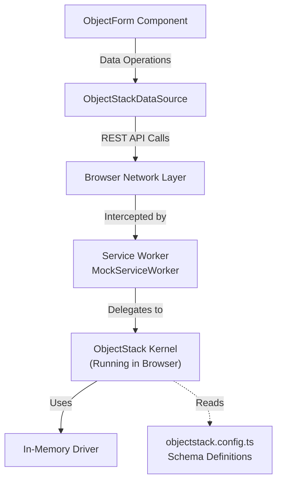

# MSW ObjectForm Example

This example demonstrates a complete **ObjectForm** integration with **Mock Service Worker (MSW)** for testing and development. It runs a real ObjectStack Runtime in the browser using an in-memory driver, allowing you to develop and test forms without a backend server.

## 🏗️ Architecture

This example uses the same architecture as the [msw-react-crud](https://github.com/objectstack-ai/spec/tree/main/examples/msw-react-crud) reference implementation:



## 🎯 Key Features

- **ObjectForm Component**: Smart form component that auto-generates forms from ObjectStack schemas
- **MSW Integration**: Complete ObjectStack runtime running in the browser via Service Worker
- **Full CRUD Operations**: Create, Read, Update, Delete contacts with validation
- **Real Logic**: Schema validation, defaults, and field types enforced by ObjectStack Kernel
- **Testing Support**: MSW server setup for Node.js test environment
- **Zero Backend**: Develop and test frontend forms before backend exists

## 📦 What's Inside

### Core Files

- **`src/App.tsx`** - Main application component with ObjectForm integration
- **`src/components/ContactList.tsx`** - Contact list component with edit/delete
- **`src/dataSource.ts`** - ObjectStack DataSource adapter for ObjectForm
- **`src/mocks/browser.ts`** - MSW setup with ObjectStack Kernel (for browser)
- **`src/mocks/server.ts`** - MSW setup for Node.js testing environment
- **`objectstack.config.ts`** - Contact object schema definition

### Test Files

- **`src/__tests__/MSWServer.test.tsx`** - ✅ **Working Tests** - MSW server integration tests
- **`src/__tests__/ObjectFormUnit.test.tsx`** - Unit tests with mock DataSource (partial)
- **`src/__tests__/ObjectForm.test.tsx`** - Integration tests (requires HTTP interception setup)

## 🚀 Getting Started

### Installation

```bash
# Install dependencies (from repository root)
pnpm install

# Navigate to example directory
cd examples/msw-object-form
```

### Development

```bash
# Start development server
pnpm dev
```

Open [http://localhost:5173](http://localhost:5173) to view the app. You can:
- Create new contacts using the form
- Edit existing contacts
- Delete contacts
- See data persist in browser memory

### Testing

```bash
# Run all tests
pnpm test

# Run specific test file
pnpm test MSWServer.test.tsx

# Run tests in watch mode
pnpm test:watch

# Run tests with UI
pnpm test:ui
```

### Build

```bash
# Build for production
pnpm build

# Preview production build
pnpm preview
```

## 📝 Usage Example

### Basic ObjectForm Integration

```tsx
import { ObjectForm } from '@object-ui/plugin-form';
import { ObjectStackDataSource } from './dataSource';
import { ObjectStackClient } from '@objectstack/client';

// Initialize client and data source
const client = new ObjectStackClient({ baseUrl: '' });
await client.connect();
const dataSource = new ObjectStackDataSource(client);

// Render ObjectForm
<ObjectForm
  schema={{
    type: 'object-form',
    objectName: 'contact',
    mode: 'create', // or 'edit' or 'view'
    fields: ['name', 'email', 'phone', 'company'],
    layout: 'vertical',
    onSuccess: (data) => console.log('Created:', data),
  }}
  dataSource={dataSource}
/>
```

### Testing with MSW Server

```tsx
import { startMockServer, stopMockServer, getDriver } from './mocks/server';

// Start MSW server for tests
beforeAll(async () => {
  await startMockServer();
});

afterAll(() => {
  stopMockServer();
});

// Test with direct driver access
it('should initialize with data', async () => {
  const driver = getDriver();
  const contacts = await driver!.find('contact', {});
  expect(contacts).toHaveLength(3);
});
```

## 🔧 Customization

### Modify the Schema

Edit `objectstack.config.ts` to add/remove fields or change object properties:

```typescript
export const ContactObject = {
  name: 'contact',
  fields: {
    // Add your custom fields here
    custom_field: { 
      name: 'custom_field', 
      label: 'Custom Field', 
      type: 'text' 
    },
  }
};
```

### Add Custom Validation

Implement custom validation in the ObjectForm schema:

```tsx
<ObjectForm
  schema={{
    customFields: [
      {
        name: 'email',
        label: 'Email',
        type: 'email',
        validation: {
          pattern: /^[^\s@]+@[^\s@]+\.[^\s@]+$/,
          message: 'Invalid email format'
        }
      }
    ]
  }}
/>
```

## 📚 Learn More

- [ObjectForm Documentation](../../packages/plugin-form/README.md)
- [ObjectStack Documentation](https://objectstack.dev)
- [MSW Documentation](https://mswjs.io/)
- [Reference Example](https://github.com/objectstack-ai/spec/tree/main/examples/msw-react-crud)

## 🧪 Test Coverage

### ✅ Working Tests

**MSW Server Integration** (`MSWServer.test.tsx`):
- ✅ MSW server initialization with data
- ✅ Direct driver CRUD operations
- ✅ Data persistence

### 🔨 In Progress

**ObjectForm Unit Tests** (`ObjectFormUnit.test.tsx`):
- ✅ Form rendering with different field types
- ✅ Field type detection
- ⚠️ Form submission (needs adjustment for react-hook-form)
- ⚠️ Callbacks (requires proper event handling)

**ObjectForm Integration** (`ObjectForm.test.tsx`):
- ⚠️ Requires HTTP interception setup in test environment

## 📝 Notes

- The app works perfectly in the browser with MSW worker
- MSW server setup works great for Node.js test environment
- Direct driver access is tested and working
- HTTP interception in tests requires additional configuration with happy-dom

## 📄 License

MIT © ObjectStack Inc.
