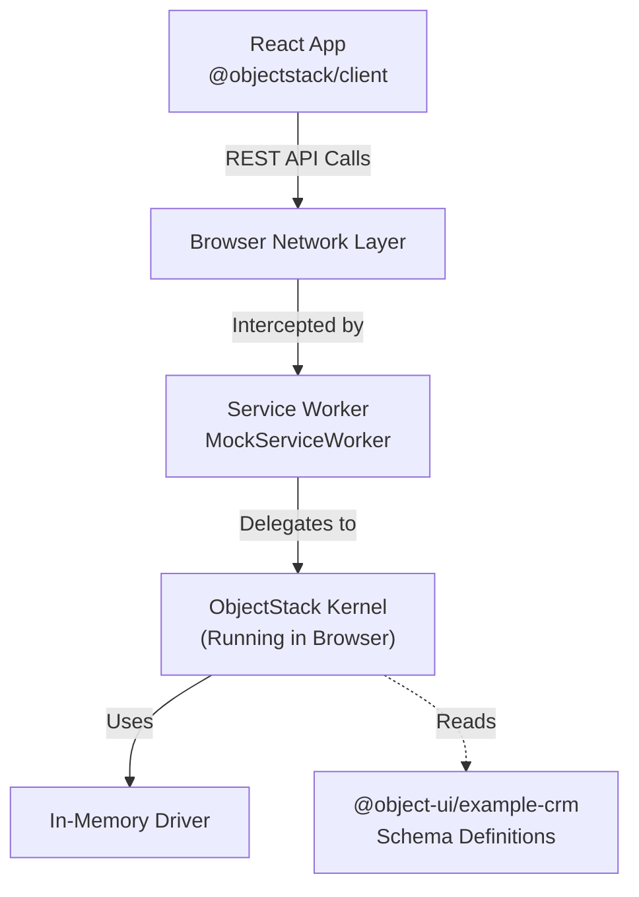

# CRM App Example with MSW

This example demonstrates a **Frontend-First** development workflow for a CRM application using **ObjectStack** with MSW (Mock Service Worker). 

It runs the entire **ObjectStack Runtime (Kernel)** directly in the browser using a Service Worker. This allows you to develop fully functional CRM applications with CRUD capabilities, validation, and API interactions **without running a backend server**.

## 🏗️ Architecture

Instead of mocking individual HTTP endpoints manually, this project spins up a real ObjectStack instance inside the browser memory.



## 🎯 Key Features

- **Zero-Backend Development**: Develop the entire frontend flow before the backend exists.
- **Real Logic**: It's not just static JSON. The Kernel enforces schema validation, defaults, and even automation logic.
- **Shared Schema**: The same ObjectStack config used here can be deployed to the real Node.js server later.
- **Instant Feedback**: Changes to the schema are reflected immediately in the browser.
- **CRM Functionality**: Complete CRM features including Contacts, Opportunities, Dashboard, and more.

## 📦 Data Models

This example includes three main objects:

1. **Contact** - Customer contact information (name, email, phone, company, status)
2. **Opportunity** - Sales opportunities with stages and amounts
3. **Account** - Company/organization records

## 🛠️ Implementation

### 1. MSW Setup

The MSW configuration is in `src/mocks/browser.ts`:

```typescript
import { ObjectKernel, DriverPlugin, AppPlugin } from '@objectstack/runtime';
import { ObjectQLPlugin } from '@objectstack/objectql';
import { InMemoryDriver } from '@objectstack/driver-memory';
import { MSWPlugin } from '@objectstack/plugin-msw';
import { config as crmConfig } from '@object-ui/example-crm';

export async function startMockServer() {
  const driver = new InMemoryDriver();
  const kernel = new ObjectKernel();

  kernel
    .use(new ObjectQLPlugin())
    .use(new DriverPlugin(driver, 'memory'))
    .use(new AppPlugin(crmConfig))
    .use(new MSWPlugin({
      enableBrowser: true,
      baseUrl: '/api/v1',
      logRequests: true
    }));
  
  await kernel.bootstrap();
  
  // Seed initial data from manifest
  await initializeMockData(driver);
}
```

### 2. Bootstrap Process

The application bootstraps in `src/main.tsx`:

```typescript
async function bootstrap() {
  // 1. Start MSW Mock Server (Critical: Must be first)
  console.log('🛑 Bootstrapping Mock Server...');
  await startMockServer();

  // 2. Initialize Clients (Must happen AFTER MSW is ready)
  console.log('🔌 Connecting Clients...');
  await initClient(); 

  // 3. Render React App
  console.log('🚀 Rendering App...');
  ReactDOM.createRoot(document.getElementById('root')!).render(
    <React.StrictMode>
      <App />
    </React.StrictMode>
  );
}

bootstrap().catch(err => {
  console.error("FATAL: Application failed to start", err);
  document.body.innerHTML = `<div style="color:red; padding: 20px;"><h1>Application Error</h1><pre>${err.message}</pre></div>`;
});
```

### 3. Client Connection

The ObjectStack client is configured in `src/client.ts`:

```typescript
import { ObjectStackClient } from '@objectstack/client';
import { ObjectStackAdapter } from '@object-ui/data-objectstack';

export const client = new ObjectStackClient({
  baseUrl: '', // Relative path, intercepted by MSW
});

export const dataSource = new ObjectStackAdapter({
  baseUrl: '',
  token: 'mock-token',
});

export const initClient = async () => {
  await client.connect();
};
```

## 🚀 Running the Example

```bash
# Install dependencies (from root)
pnpm install

# Start the dev server
cd examples/crm-app
pnpm dev
```

Open `http://localhost:5173` (or the port shown in terminal). You can now:

- View the dashboard with stats
- Browse and filter contacts
- Create, edit, and delete contacts
- View and manage opportunities
- All data persists in browser memory during the session

## 🧪 Testing

The example includes tests that verify MSW integration:

```bash
pnpm test
```

## 📱 Features

### Dashboard
- Revenue, leads, and deals statistics
- Recent contacts list
- Quick access navigation

### Contacts
- Grid view with sorting and filtering
- Create/Edit/Delete operations
- Detail views with full information
- Status management (Active, Lead, Customer)

### Opportunities
- Sales pipeline visualization
- Stage tracking
- Amount and close date management
- Contact associations

## 📦 Migration to Production

When you are ready to go to production:

1. Keep the ObjectStack config in `@object-ui/example-crm`.
2. Deploy the official ObjectStack Server (Node.js).
3. Point your `ObjectStackClient` `baseUrl` to the real server.
4. Remove or conditionally disable the `startMockServer()` call in `main.tsx`.

No frontend code needs to change!

## 🔍 Debugging

The application includes extensive logging:

- `[MSW]` - Mock Service Worker events
- `[Kernel]` - ObjectStack Kernel operations
- `[Client]` - Client connection events
- `[DEBUG-FETCH]` - API request debugging

Check the browser console for detailed logs during development.

## 📚 Learn More

- [ObjectStack Documentation](https://objectstack.ai)
- [MSW Documentation](https://mswjs.io/)
- [ObjectUI Documentation](https://objectui.dev)
